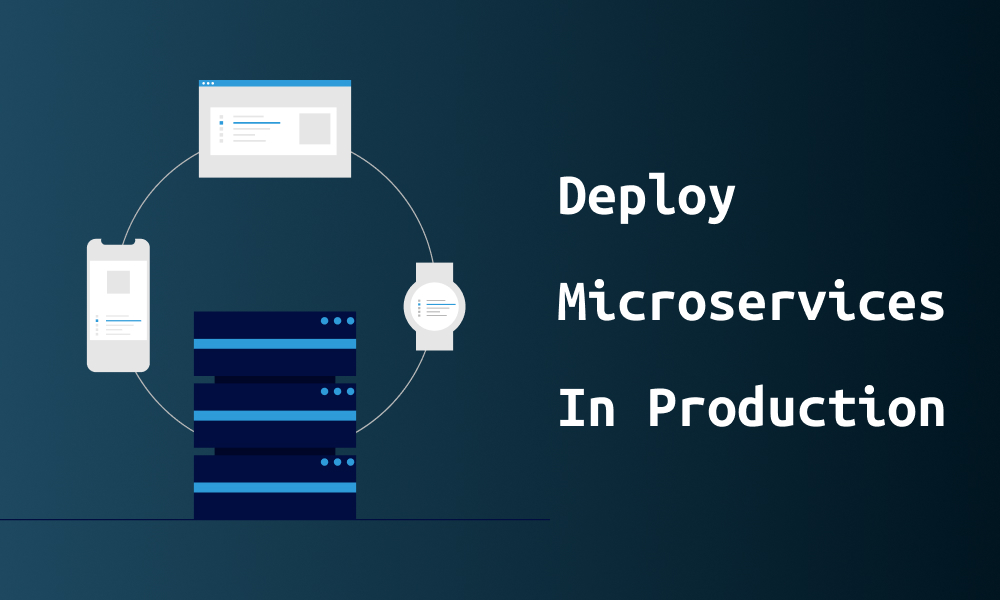

﷽

Deploy Microservices In Production

Written by **Mehdi CHEBBAH** & **Yacine ZIDELMAL**.

---

[TOC]

---

# Introduction

In this article we will learn the difference between deploying a monolithic application and deploying a microservices application, we will discuss the different available options and the advantages and disadvantages of each of them. So lets get straight into it.

Deploying a monolithic application means running multiple, identical copies of a single, usually large application. You typically provision N servers (physical or virtual) and run M instances of the application on each one. The deployment of a monolithic application is not always entirely straightforward, but it is much simpler than deploying a microservices application.

A microservices application consists of tens -or even hundreds- of services. Services are written in a variety of languages and frameworks. Each one is a mini‑application with its own specific deployment, resources, scaling, and monitoring requirements. For example, you need to run a certain number of instances of each service based on the demand for that service. Also, each service instance must be provided with the appropriate CPU, memory, and I/O resources. What is even more challenging is that despite this complexity, deploying services must be fast, reliable and cost‑effective.

# Deployment techniques

There are multiple ways of deploying a microservices based system, here they are:

## Multiple service instances per host

The first way is to run multiple instances of different services on a host (Physical or Virtual machine). The deployed system looks like this:

The benefits of this pattern include:

+ More efficient resource utilization than one service instance per host (The next pattern).

The drawbacks of this approach include:

+ Risk of conflicting resource requirements;
+ Risk of conflicting dependency versions;
+ Difficult to limit the resources consumed by a service instance;
+ If multiple services instances are deployed in the same process then its difficult to monitor the resource consumption of each service instance. Its also impossible to isolate each instance.

## Single service instance per host

The second option is to deploy each single service instance on its own host. An example of this deployment pattern is shown here:

The benefits of this approach include:

+ Services instances are isolated from one another;
+ There is no possibility of conflicting resource requirements or dependency versions;
+ A service instance can only consume at most the resources of a single host;
+ Its straightforward to monitor, manage, and redeploy each service instance;

The drawbacks of this approach include:

+ Potentially less efficient resource utilization compared to Multiple Services per Host because there are more hosts.

## Service instance per VM

Package the service as a virtual machine image and deploy each service instance as a separate VM. This means the system will look like this:

The benefits of this approach include:

+ Its straightforward to scale the service by increasing the number of instances;
+ The VM encapsulates the details of the technology used to build the service;
+ Each service instance is isolated;
+ A VM imposes limits on the CPU and memory consumed by a service instance;
+ IaaS solutions such as AWS provide a mature and feature rich infrastructure for deploying and managing virtual machines;

The drawbacks of this approach include:

+ Building a VM image is slow and time consuming.

## Service instance per Container

Package the service as a container image and deploy each service instance as a container.  Docker could be used to create container images and these containers could be manipulated using a framework such us Docker Compose, Kubernetes, Marathon/Mesos, ...etc. This solution is presented in the following figure:

The benefits of this approach include:

+ It is straightforward to scale up and down a service by changing the number of container instances;
+ The container encapsulates the details of the technology used to build the service;
+ Each service instance is isolated;
+ A container imposes limits on the CPU and memory consumed by a service instance;
+ Containers are extremely fast to build and start. For example, it’s 100x faster to package an application as a Docker container than it is to package it as a VM. Docker containers also start much faster than a VM since only the application process starts rather than an entire OS.

The drawbacks of this approach include:

+ The infrastructure for deploying containers is not as rich as the infrastructure for deploying virtual machines.

# Conclusion

We can recap the pros and cons of the mentioned 4 strategies in the following table:

|                       | Multiple instances per host | Single instance per host | Single instance per VM | Single instance per container |
| --------------------- | :-------------------------: | :----------------------: | :--------------------: | :---------------------------: |
| Isolation             |        No isolation         |         Isolated         |        Isolated        |           Isolated            |
| Risk of conflicts     |             Yes             |            No            |           No           |              No               |
| Resources management  |             No              |           Yes            |          Yes           |              Yes              |
| third-party solutions |        No solutions         |      Some solutions      |   Multiple solutions   |      A lot of solutions       |
| Resources efficiency  |          Efficient          |      Not efficient       |       Efficient        |        Very efficient         |
| Scaling               |            Hard             |           Easy           |       Very easy        |           Very easy           |
| Build time            |              /              |            /             |          Slow          |             Fast              |

# Further Reading

1. *Deploying Microservices: Choosing a Strategy* (2016) *NGINX*. Available at: https://www.nginx.com/blog/deploying-microservices/ (Accessed: 24 December 2021).
2. *Deploying microservices*. Available at: https://microservices.io/articles/deployment.html (Accessed: 24 December 2021).
